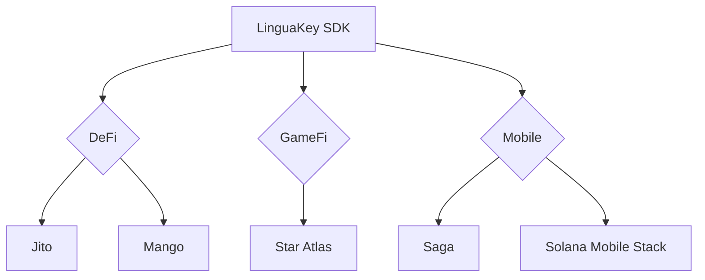

# LinguaKey for Solana: The Voice-First Future of On-Chain Interaction

[](https://solana.com)


**Unlock the power of Solana with your voice. Seamless, secure, human-speed blockchain interactions — powered by biometrics.**


------


## **🚀 Why Solana?**


- ⚡ **Real-Time Performance**

  Voice commands align perfectly with Solana’s ultra-fast 400ms block time.

- 💸 **Near-Zero Cost**

  Execute microtransactions at <$0.0001 — ideal for AI agents and high-frequency tasks.

- 🧩 **Built for Ecosystem Integration**

  Native support for DeFi, mobile, and beyond — made to grow with Solana.


------


## **🔥 What Sets Us Apart**


### **1. Solana Passkey Wallet**


**生物识别安全：Face ID 与 Touch ID**

```typescript
// 利用设备内置的生物识别功能（例如 iPhone 上的 Face ID，MacBook 上的 Touch ID）
// 在支持 Solana Mobile Stack (SMS) 的设备上，将利用安全元件。
const wallet = await LinguaKey.create({ // 假设 LinguaKey 是 SDK 中的类名
  // 以下是创建 Passkey 所需的参数
  userIdString: 'user-unique-identifier-from-your-app', // 用于 Passkey 的唯一用户标识
  userName: 'user-login-name',                         // 用户登录名，例如邮箱
  userDisplayName: '用户的显示名称',                     // 将在生物识别提示中显示给用户
  cluster: 'mainnet-beta'                             // 可选，默认为 Solana 主网
});
```

无需密码，无需助记词。只需通过您设备内置的安全生物识别验证（例如 iPhone 上的 Face ID 或 MacBook 上的 Touch ID），即可访问您的钱包——就像解锁您的设备一样自然。


------


### **2. Solana Voice Agent**


**Turn Natural Language into On-Chain Action**

```rust
// “Stake 50 SOL to Jito and auto-compound” ➝ Automatically:
1. Interacts with Jito-Stake
2. Sets up StreamFlow compounding
3. (Optional) Deploys Mango risk hedging
```

▸ Example use cases:


- “List all Mad Lads on Tensor at 30% below floor.”
- “Use 80% of my USDC to LP on Raydium, buy BONK with the rest.”


Your intent, executed — no code, no clicks.


------


### **3. Developer SDK**


**Integrate in Minutes**

```typescript
npm install @linguakit/solana
import { Linguafy } from '@linguakit/solana'

const solanaAgent = new Linguafy({
  connection: new Connection(RPC_ENDPOINT),
  mobile: true, // SMS-optimized transactions
  plugins: [
    '@linguakit/jito',
    '@linguakit/mango'
  ]
})
```

Fast setup. Full control. Expand with ecosystem plugins.


------


## **🌐 Ecosystem Map**




------


> “When Solana’s speed meets the human voice, blockchain finally speaks our language.”
