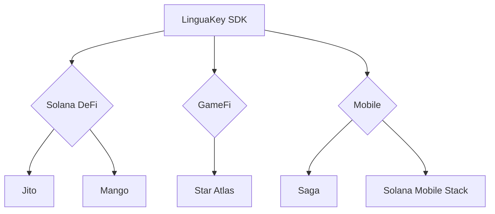

# LinguaKey for Solana：语音优先的链上交互革命

[](https://solana.com)

**用生物特征解锁Solana生态，让每个交互请求都像发送消息一样简单**

---

## 🚀 为什么选择Solana？

- ⚡ **速度匹配**：语音指令的实时性与Solana 400ms出块速度完美契合
- 💸 **成本归零**：单笔交易<$0.0001，支持无限次AI Agent自动微交易
- 🧩 **生态协同**：从DeFi到Mobile，全面适配Solana原生创新场景

---

## 🔥 核心创新

### 1. Solana Passkey Wallet
**生物特征即身份**
```typescript
// 使用SMS（Solana Mobile Stack）安全元件
const wallet = await LinguaSol.create({
  biometric: 'faceID', // 支持SecureElement模块
  cluster: 'mainnet-beta'
})
```

### 2. Solana Voice Agent

**链上意图翻译器**

```rust
// 解析自然语言到SeaLevel指令
"质押50SOL到Jito并自动复投" ➔ Agent自动：
1. 调用Jito-Stake程序
2. 配置StreamFlow定期复投
3. 生成Mango Markets风险对冲合约（可选）
```

▸ 支持场景：

- NFT批量挂单："在Tensor上以30%低于地板价挂售所有Mad Lads"
- DeFi组合操作："用80%的USDC在Raydium做LP，剩余20%买入BONK"

### 3. Solana SDK
**五分钟集成指南**

```bash
npm install @linguakit/solana
```
```javascript
import { Linguafy } from '@linguakit/solana'

const solanaAgent = new Linguafy({
  connection: new Connection(RPC_ENDPOINT),
  mobile: true, // 启用SMS压缩交易
  plugins: [ // 生态插件市场
    '@linguakit/jito',
    '@linguakit/mango'
  ]
})
```

## 🌐 生态全景图



---

> "当Solana的闪电速度遇见自然语言交互，区块链第一次有了人类的速度" — 来自首批残障开发者测试反馈
